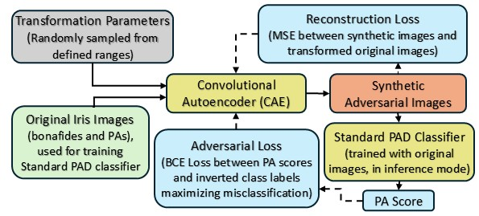

# A Parametric Approach to Adversarial Augmentation for Cross-Domain Iris Presentation Attack Detection
<b>Abstract:</b> Iris-based biometric systems are vulnerable to presentation attacks (PAs), where adversaries present physical artifacts (e.g., printed iris images, textured contact lenses) to defeat the system. This has led to the development of various presentation attack detection (PAD) algorithms, which typically perform well in intra-domain settings. However, they often struggle to generalize effectively in cross-domain scenarios, where training and testing employ different sensors, PA instruments, and datasets. In this work, we use adversarial training samples of both bonafide irides and PAs to improve the cross-domain performance of a PAD classifier. The novelty of our approach lies in leveraging transformation parameters from classical data augmentation schemes (e.g., translation, rotation) to generate adversarial samples. We achieve this through a convolutional autoencoder, ADV-GEN, that inputs original training samples along with a set of geometric and photometric transformations. The transformation parameters act as regularization variables, guiding ADV-GEN to generate adversarial samples in a constrained search space. Experiments conducted on the LivDet-Iris 2017 database, comprising four datasets, and the LivDet-Iris 2020 dataset, demonstrate the efficacy of our proposed method.

<b>Link to paper:</b> https://arxiv.org/pdf/2412.07199

### ADV_GEN Framework

